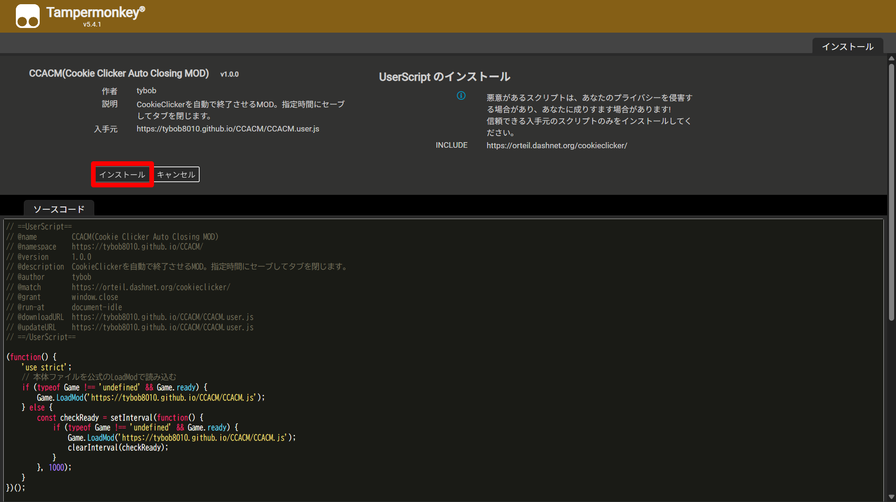

# CCACM(Cookie Clicker Auto Closing MOD)

### Latest Version : `v.1.0.0`

ブラウザ版CookieClickerを自動で終了させるMOD。指定時間にセーブしてタブを閉じます。

※[CookieClicker](https://orteil.dashnet.org/cookieclicker/)の<ins>非公式</ins>MODです。

※Steam版には対応しておりません

ライセンスは[こちら](LICENSE)

### 不明点・要望・バグ報告は[Discord](https://discord.com/invite/PYQr6WN9a3)まで。

© 2026 tybob

</br>

## 使い方
### ブックマークレット
ブラウザのブックマーク機能を利用し、MODを起動させる方法です。

ブラウザの拡張機能を導入する必要がなく簡単ですが、ゲームを開くたびに操作が必要になるため、Userscriptを利用する方法を推奨します。

#### 1. 好きなページをブックマークし、右クリックし「編集」を押す

#### 2. 「名前」は任意の名前を入力し、「URL」に以下のコードをコピペする

```js
javascript:(function(){Game.LoadMod('https://tybob8010.github.io/CCACM/CCACM.js')})();
```

#### 3. CookieClickerのページでブックマークをクリックする

</br>

### Userscript (推奨)
TampermonkeyなどUserscript対応の拡張機能を利用し、MODを起動させる方法です。

拡張機能の導入が必要ですが、CookieClickerを開いたら自動的に起動するため、こちらを推奨しています。

#### 1. [こちら](https://chromewebstore.google.com/detail/tampermonkey/dhdgffkkebhmkfjojejmpbldmpobfkfo?hl=ja)から拡張機能をインストールする(Chrome,Edgeの方)
※ Firefoxの方は[こちら](https://addons.mozilla.org/en-US/firefox/addon/tampermonkey/)から

#### 2. 拡張機能をインストールしたのちに[こちら](https://tybob8010.github.io/CCACM/CCACM.user.js)をクリックする

#### 3. 「インストール」をクリック


※CookieClickerを開いた状態でMODをインストールすると起動しない場合があります。その場合はCtrl+SでセーブしてからCookieClickerを再読み込みしてください。

</br>

## バージョン情報
### v.1.0.0

*2026/03/15公開*

* CCACMをリリース
